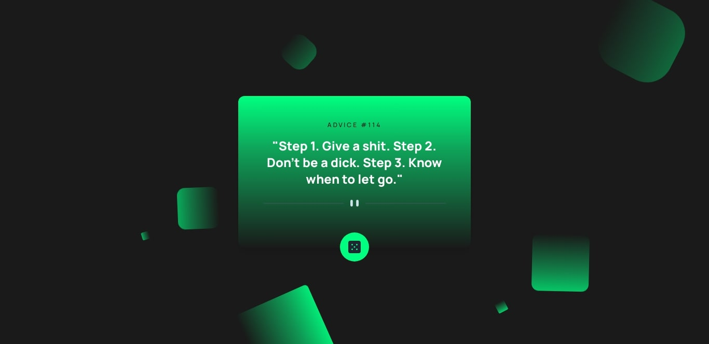

# Advice Generator App

This is a solution to the [Advice generator app challenge on Frontend Mentor](https://www.frontendmentor.io/challenges/advice-generator-app-QdUG-13db).

## Table of contents

- [Overview](#overview)
  - [The challenge](#the-challenge)
  - [Screenshot](#screenshot)
  - [Links](#links)
- [My process](#my-process)
  - [Built with](#built-with)
  - [What I learned](#what-i-learned)
  - [Continued development](#continued-development)
- [Author](#author)
- [Acknowledgments](#acknowledgments)

## Overview

### The challenge

Users should be able to:

- See hover states for all interactive elements on the page
- Generate a new piece of advice by clicking the dice icon
- View the optimal layout for the app depending on their device's screen size

### Screenshot



### Links

- Solution URL: [Github](https://your-solution-url.com)
- Live Site URL: [On Netlify](https://your-live-site-url.com)

## My process

- Creating the UI for this project was relatively simple and only took me around 25-30 minutes to complete.
- Including the animations, it took about an hour to complete.
- Perhaps, the most challenging aspect was fetching data from the API, as I encountered multiple errors during the process. Despite these setbacks, I was eventually able to make it work after several attempts."

### Built with

- Flexbox
- CSS Grid
- [React](https://reactjs.org/) - JS library
- Mobile-first workflow
- CSS custom properties
- Semantic HTML5 markup

### What I learned

- This was my first time creating an API project using React and it was a new learning experience for me.
- Despite the simplicity of the project, it was still challenging.
- I learned about fetching data from an API and using it to populate the DOM.
- I also gained experience with Async/Await and Try/Catch.

- Check out the code snippet below for a glimpse of my implementation,

```JavaScript react
  const getAdvice = async () => {
    try {
      const response = await fetch(URL);
      if (!response.ok) {
        throw new Error(
          `This is an HTTP error: The status is ${response.status}`
        );
      }
      let Data = await response.json();
      setAdvice(Data.slip);
    } catch (err) {
      setError(err.message);
      setAdvice(null);
    }
  };
```

### Continued development

- In the future, I plan to continue learning about fetching data from APIs and also creating more projects that utilize API data

## Author

- Website - [Github](https://github.com/SameerJS6)
- Frontend Mentor - [@SameerJS6](https://www.frontendmentor.io/profile/sameerjs6)

## Acknowledgments

- Props to Google
